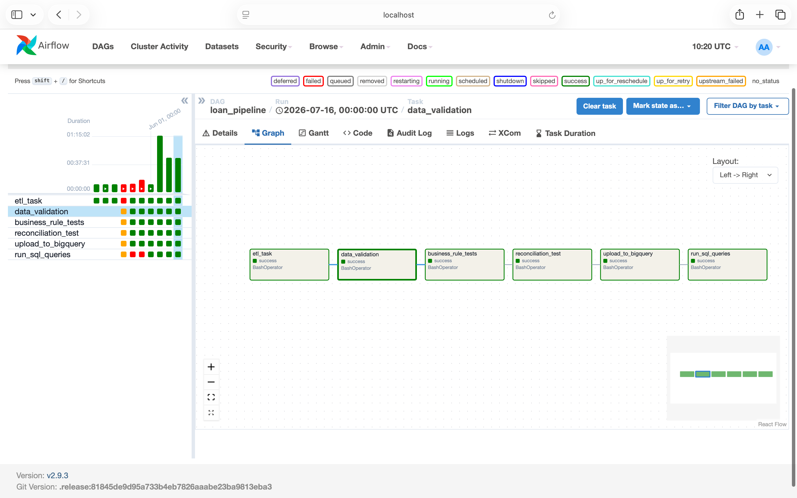
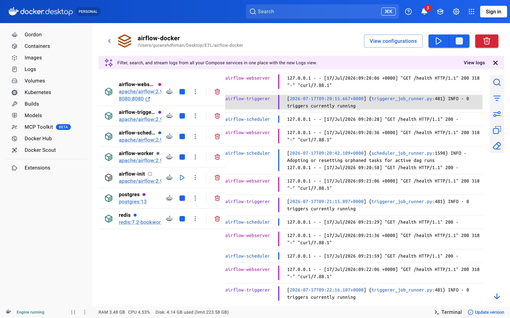
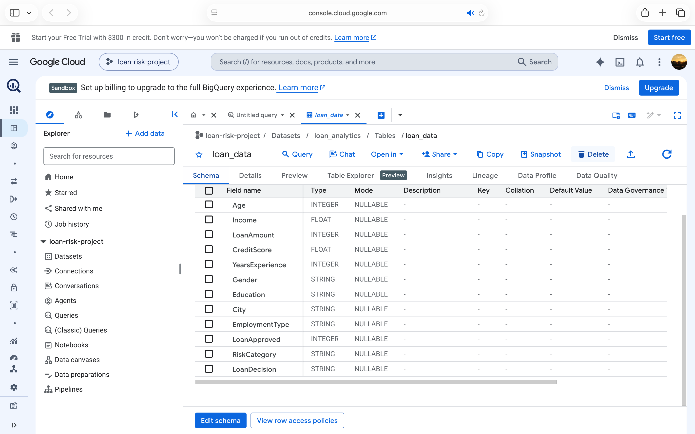
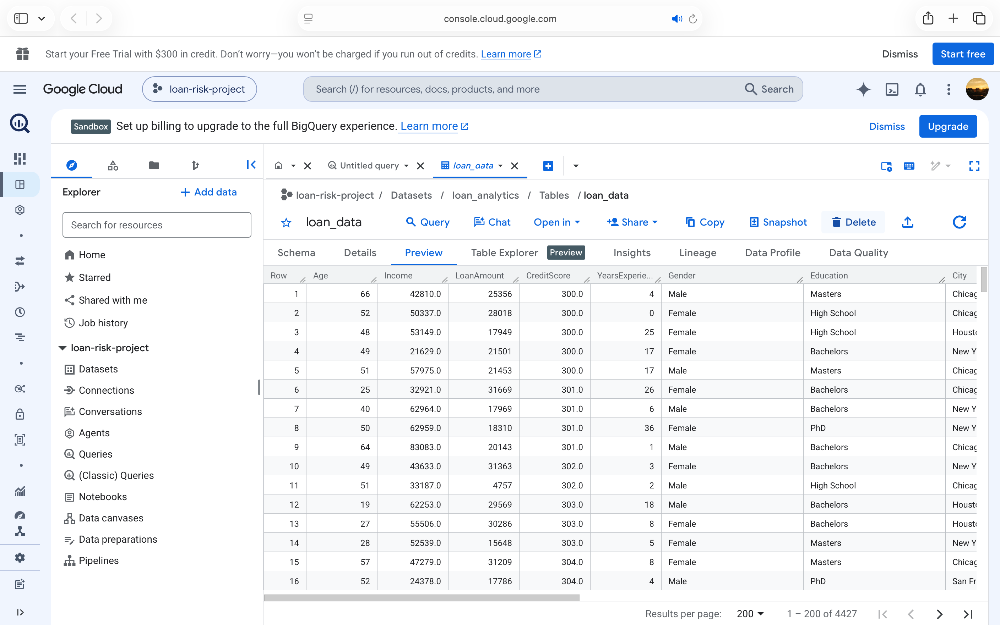
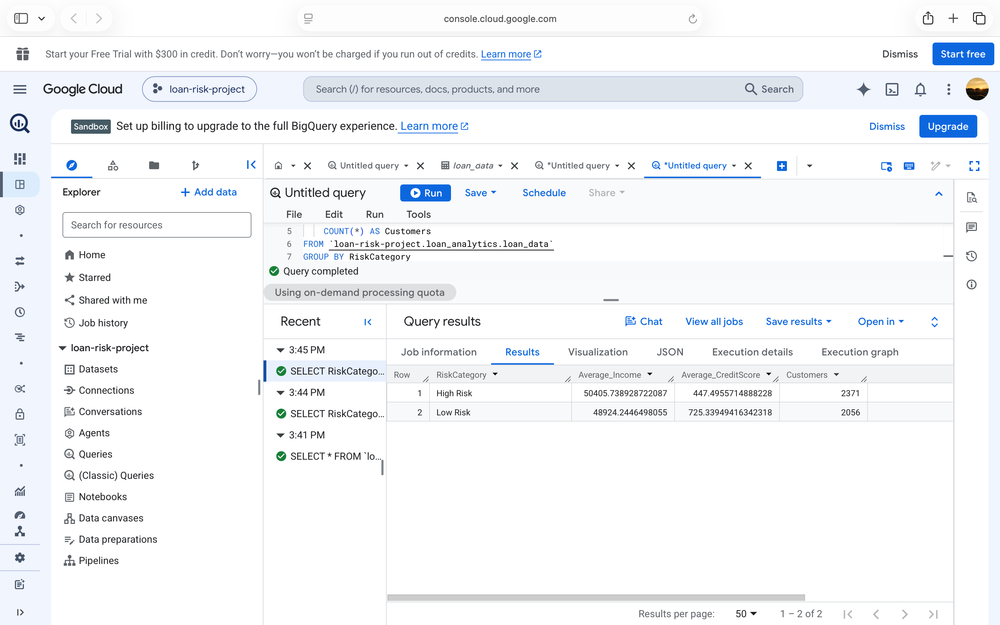
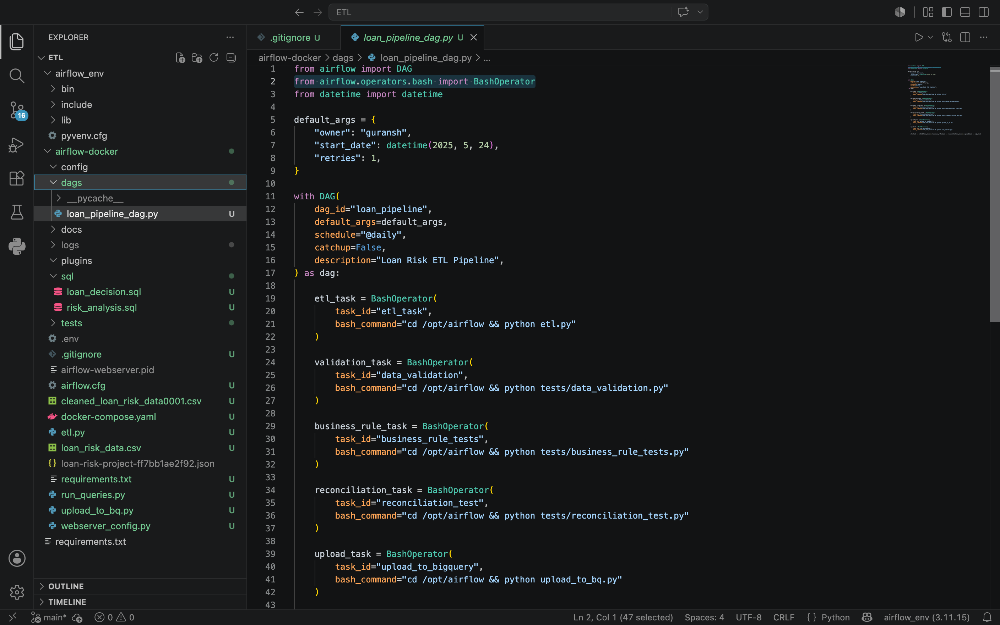

#  Loan Risk ETL Pipeline

An end-to-end ETL (Extract, Transform, Load) pipeline built using Python,Apache Airflow,Docker,Google BigQuery and SQL.
The project automates data ingestion, cleaning, validation, transformation, and loading into BigQuery for analytics.

-----------------------------------------------------------------------------------------------------------------------------------

##  Project Overview

This project demonstrates how to build a production-style ETL pipeline using modern data engineering tools.

The pipeline:

- Extracts raw loan application data from a CSV file
- Cleans and transforms the dataset
- Performs automated data validation
- Executes business rule testing
- Loads processed data into Google BigQuery
- Runs SQL queries to generate business insights
- Automates the workflow using Apache Airflow


-----------------------------------------------------------------------------------------------------------------------------------

##  Architecture


```
             Raw Loan Dataset (CSV)
                      │
                      ▼
               Python ETL Pipeline
                      │
        ┌─────────────┼─────────────┐
        ▼             ▼             ▼
 Data Cleaning   Validation Tests  Business Rules
                      │
                      ▼
              Apache Airflow DAG
                      │
                      ▼
          Google BigQuery Warehouse
                      │
                      ▼
               SQL Analytics Layer
```


-----------------------------------------------------------------------------------------------------------------------------------

##  Tech Stack

| Category               | Technology      |
|------------------------|-----------------|
| Programming Language   | Python          |
| Workflow Orchestration | Apache Airflow  |
| Containerization       | Docker          |
| Cloud Data Warehouse   | Google BigQuery |
| Query Language         | SQL             |
| Version Control        | Git & GitHub    |


-----------------------------------------------------------------------------------------------------------------------------------

##  Features

1 End-to-end ETL pipeline.
2 Automated workflow orchestration using Apache Airflow.
3 Dockerized deployment.
4 Data cleaning and preprocessing.
5 Data validation tests.
6 Business rule testing.
7 Data reconciliation checks.
8 Automated upload to Google BigQuery.
9 SQL-based business analytics.
10 Modular project structure.


-----------------------------------------------------------------------------------------------------------------------------------

##  Project Structure

```text
airflow-docker/
│
├── dags/
├── docs/
│   └── screenshots/
├── sql/
├── tests/
├── etl.py
├── upload_to_bq.py
├── run_queries.py
├── docker-compose.yaml
├── requirements.txt
├── README.md
└── .gitignore
```


-----------------------------------------------------------------------------------------------------------------------------------

##  ETL Workflow

1. Load raw loan dataset
2. Clean missing and duplicate records
3. Apply business transformations
4. Validate dataset integrity
5. Perform business rule testing
6. Load processed data into Google BigQuery
7. Execute SQL queries for analytics


-----------------------------------------------------------------------------------------------------------------------------------

#  Project Screenshots

## Apache Airflow DAG




-----------------------------------------------------------------------------------------------------------------------------------

## Docker Containers




-----------------------------------------------------------------------------------------------------------------------------------

## BigQuery Dataset Schema




-----------------------------------------------------------------------------------------------------------------------------------

## BigQuery Table Preview




-----------------------------------------------------------------------------------------------------------------------------------

## SQL Analytics




-----------------------------------------------------------------------------------------------------------------------------------

## Project Structure




-----------------------------------------------------------------------------------------------------------------------------------

##  Example SQL Analytics

Example business questions answered:

1 Average customer income by risk category.
2 Credit score distribution.
3 Loan approval trends.
4 Customer segmentation.
5 Risk category analysis.


-----------------------------------------------------------------------------------------------------------------------------------

##  Installation

Clone the repository:

```bash
git clone https://github.com/gurkaansh313-design/Loan-Risk-ETL-Pipeline.git
```

Move into the project directory:

```bash
cd Loan-Risk-ETL-Pipeline
```

Install dependencies:

```bash
pip install -r requirements.txt
```

Start Airflow:

```bash
docker compose up -d
```

Access Airflow:

```
http://localhost:8080
```

--------------------------------------------------------------------------------------------------------------------------------------

##  Future Improvements

1 CI/CD using GitHub Actions.
2 Incremental ETL processing.
3 Cloud deployment.
4 Data quality monitoring.
5 Interactive Power BI/Tableau dashboard.
6 Unit test coverage expansion.


-----------------------------------------------------------------------------------------------------------------------------------

##  Author

**Guransh Dhiman**

B.Tech Metallurgical & Materials  Engineering

Punjab Engineering College (PEC), Chandigarh

GitHub:
https://github.com/gurkaansh313-design
